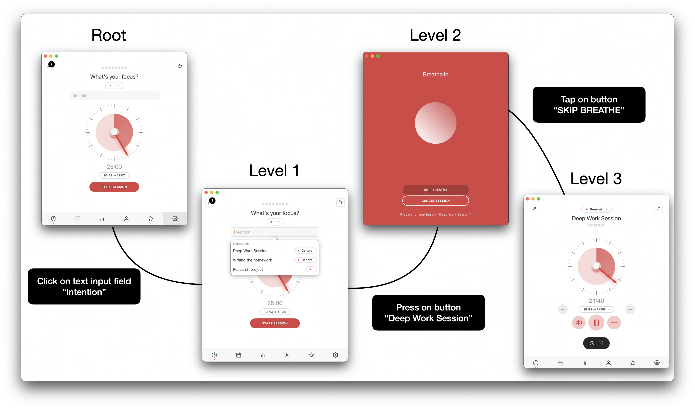
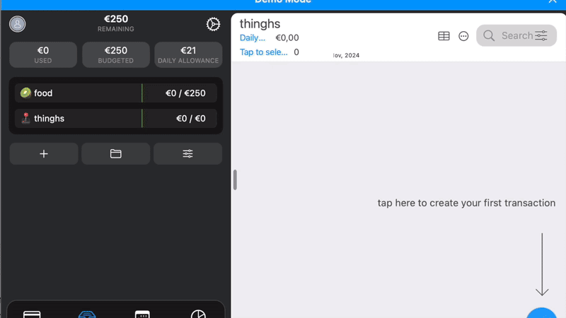
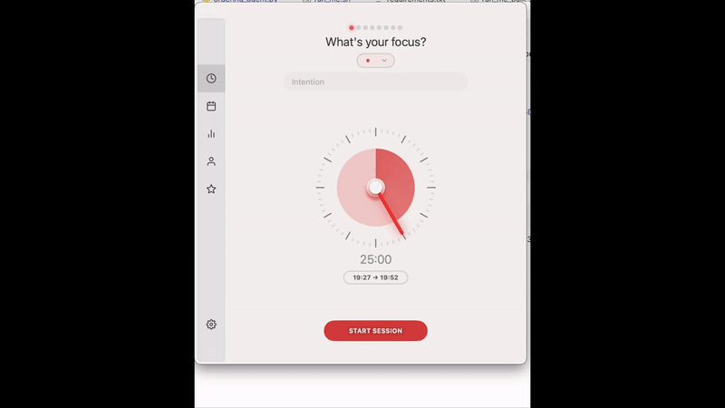
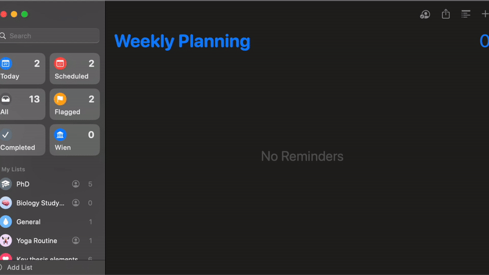



**CrawlMacOS** is a fully automated framework for exploring macOS applications via the accessibility API. It generates a large-scale dataset of full-desktop screenshots, interaction graphs, and task specifications, enabling research in complex, multi-window desktop agents.

% 
% 
% 
% 

## 🚀 Key Features

- Full-desktop screenshots across real macOS apps
- GPT-4-guided autonomous crawling and interaction
- Structured UI interaction graphs and task traces
- Fully open-source and reproducible

## 📊 Dataset

- Applications: XYZ macOS apps
- Tasks: XYZ total interaction steps
- Format: Screenshot + Accessibility metadata + Interaction graph

[Download Dataset](#)  
[Read the Paper (NeurIPS Submission)](#)

## 📂 Repository Structure

- `crawler/`: The autonomous crawling pipeline
- `data/`: Collected UI screenshots and interaction graphs
- `scripts/`: Utilities for preprocessing and model evaluation
- `agents/`: GPT-4 agent logic (input generation, ordering, task postprocessing)

### Navigation

- [Home](index.md)
- [Examples](examples.md)
- [Dataset](#)
- [Paper](#)

